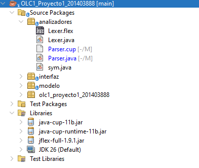
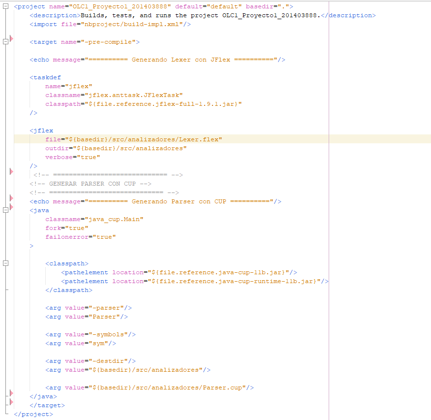

# Manual Técnico

## Battle Script - OLC1

**Organización de Lenguajes y Compiladores 1**

---

## 1. Introducción

Battle Script es una aplicación desarrollada como proyecto de Organización
de Lenguajes y Compiladores 1.

El sistema permite analizar y ejecutar archivos con extensión `.btl`, los cuales
describen estrategias de personajes, partidas, reglas de combate, sistemas de
puntuación, bonificaciones y las partidas que deben ejecutarse desde la sección
`main`.

La aplicación está compuesta principalmente por un analizador léxico,
un analizador sintáctico, estructuras de datos para representar el lenguaje,
un motor de ejecución de batallas y una interfaz gráfica.

---

## 2. Lenguaje de programación

El proyecto fue desarrollado utilizando el lenguaje de programación **Java**.

Java se utiliza para implementar:

- La interfaz gráfica.
- Las estructuras utilizadas para representar las instrucciones del lenguaje.
- El manejo de archivos `.btl`.
- El almacenamiento de tokens y errores.
- El motor de ejecución de las batallas.
- La integración con JFlex y CUP.

---

## 3. Herramientas y librerías utilizadas

Para el desarrollo del proyecto se utilizaron las siguientes herramientas:

### 3.1 Apache NetBeans

Se utilizó Apache NetBeans como IDE para la implementación,
compilación y ejecución del proyecto.

### 3.2 JFlex

JFlex se utiliza para implementar el analizador léxico.

El archivo principal de configuración es:

`Lexer.flex`

A partir de este archivo se genera la clase:

`Lexer.java`

Ambos archivos se encuentran en el paquete de analizadores.

El analizador léxico reconoce palabras reservadas, identificadores, números,
operadores, símbolos, acciones y demás elementos definidos por Battle Script.

### 3.3 Java CUP

Java CUP se utiliza para implementar el analizador sintáctico del lenguaje.

El archivo principal de configuración es:

`Parser.cup`

A partir de este archivo se genera la clase:

`Parser.java`

Ambos archivos se encuentran en el paquete de analizadores.

El analizador sintactico contiene los terminales, no terminales y producciones necesarias
para reconocer la estructura de un archivo `.btl`.

### 3.4 Java Swing

Java Swing se utiliza para implementar la interfaz gráfica de la aplicación.

La interfaz permite:

- Crear archivos.
- Abrir archivos `.btl`.
- Editar archivos.
- Guardar archivos.
- Analizar y ejecutar el código.
- Visualizar tokens.
- Visualizar errores.
- Visualizar la ejecución de las batallas.

### 3.5 Apache Ant

El proyecto utiliza Apache Ant como sistema de construcción.

El archivo:

`build.xml`

contiene la configuración utilizada para realizar la construcción del proyecto
y generar los analizadores necesarios.

---

## 4. Estructura general del proyecto

El proyecto está organizado principalmente en los siguientes paquetes:

### 4.1 Paquete `analizadores`

Contiene los archivos relacionados con el análisis léxico y sintáctico.

Entre los archivos principales se encuentran:

- `Lexer.flex`
- `Lexer.java`
- `Parser.cup`
- Archivos generados por CUP **Parser.java y sym.java**.

### 4.2 Paquete `modelo`

Contiene las clases utilizadas para representar la información obtenida
durante el análisis y ejecutar las batallas.

Entre las clases principales se encuentran:

- `Programa`
- `Principal`
- `Estrategia`
- `Regla`
- `Condicion`
- `Partida`
- `Scoring`
- `Bonuses`
- `EstadoJugador`
- `Batalla`
- `ErrorToken`
- `Token`

### 4.3 Paquete `interfaz`

Contiene la interfaz gráfica de la aplicación.

La clase principal de este paquete es:

`FramePrincipal`

Esta clase permite la interacción entre el usuario, el analizador y el motor
de ejecución.

---

## 5. Clases principales

### 5.1 Programa

La clase `Programa` almacena la información general obtenida después del
análisis del archivo de entrada.

Permite almacenar y buscar las estrategias y partidas definidas en el archivo.

También contiene la información correspondiente a la sección principal del
programa.

### 5.2 Estrategia

La clase `Estrategia` representa un personaje definido en Battle Language.

Almacena información como:

- Nombre.
- Tipo de personaje (`mage` o `warrior`).
- Acción inicial.
- Lista de reglas.

Las reglas determinan qué acción seleccionará el personaje durante una batalla.

### 5.3 Regla

La clase `Regla` representa una regla perteneciente a una estrategia.

Cada regla puede contener una condición y una acción que debe ejecutarse cuando
la condición se cumple.

También permite representar la regla `else`.

### 5.4 Condicion

La clase `Condicion` representa las condiciones utilizadas dentro de las reglas.

Permite evaluar valores relacionados con el estado de la batalla, entre ellos:

- `self_health`
- `opponent_health`
- `self_resource`
- `opponent_resource`
- `self_score`
- `opponent_score`
- `round_number`
- `total_rounds`
- `random`

También permite trabajar con operadores lógicos como `&&` y `||`, además de
funciones relacionadas con el historial de movimientos.

### 5.5 Partida

La clase `Partida` representa una batalla definida mediante `match`.

Contiene información como:

- Nombre de la partida.
- Jugador 1.
- Jugador 2.
- Cantidad de rondas.
- Configuración de puntuación.
- Bonificaciones.

### 5.6 Scoring

La clase `Scoring` almacena la configuración del sistema de puntuación.

Entre sus valores se encuentran:

- `damage_point`
- `healing_point`
- `successful_defense`
- `victory_bonus`
- `failed_action_penalty`

### 5.7 Bonuses

La clase `Bonuses` almacena las bonificaciones configuradas para una partida.

Permite representar:

- Combo del mago.
- Puntos del combo del mago.
- Combo del guerrero.
- Puntos del combo del guerrero.
- Bonificación por victoria con vida baja.

### 5.8 EstadoJugador

La clase `EstadoJugador` mantiene el estado actual de un personaje durante
una batalla.

Entre la información almacenada se encuentra:

- Nombre.
- Tipo.
- Vida.
- Recurso.
- Puntuación.
- Historial de movimientos.
- Estado de defensa.
- Mejoras de ataque.
- Velocidad.

El estado se actualiza conforme se ejecutan las acciones durante las rondas.

### 5.9 Principal

La clase `Principal` representa la información de ejecución obtenida desde
la sección `main`.

Almacena la lista de partidas solicitadas mediante `run` y el valor de `seed`
utilizado para la ejecución.

### 5.10 ErrorToken

La clase `ErrorToken` representa los errores encontrados durante el análisis.

Almacena:

- Tipo de error.
- Descripción.
- Línea.
- Columna.

Esta información se utiliza posteriormente para llenar la tabla de errores
de la interfaz.

---

## 6. Analizador léxico

El analizador léxico fue desarrollado utilizando **JFlex**.

Su configuración se encuentra en:

`Lexer.flex`

El analizador recibe como entrada el contenido del archivo `.btl` y lo divide
en tokens que posteriormente son enviados al analizador sintáctico.

Entre los elementos reconocidos se encuentran:

- Palabras reservadas.
- Identificadores.
- Números enteros.
- Números decimales.
- Operadores.
- Símbolos.
- Acciones de los personajes.
- Estados utilizados en condiciones.
- Funciones de historial.
- Comentarios.

Los tokens reconocidos son almacenados para posteriormente mostrarlos en la
tabla de tokens de la interfaz.

### 6.1 Manejo de errores léxicos

Cuando el analizador encuentra un carácter que no pertenece al lenguaje,
se registra un error léxico.

El error contiene:

- Tipo `LEXICO`.
- Descripción.
- Línea.
- Columna.

Después de registrar el carácter no reconocido, el analizador continúa
procesando la entrada, permitiendo detectar más errores léxicos dentro del
mismo archivo.

---

## 7. Analizador sintáctico

El analizador sintáctico fue implementado utilizando **Java CUP**.

La gramática utilizada por el parser se encuentra definida en:

`Parser.cup`

El parser recibe los tokens generados por JFlex y verifica que estos cumplan
con la estructura definida para Battle Language.

Entre las estructuras reconocidas se encuentran:

- Estrategias `mage`.
- Estrategias `warrior`.
- Acciones iniciales.
- Reglas.
- Condiciones.
- Partidas `match`.
- Jugadores.
- Rondas.
- Sistema de puntuación.
- Bonificaciones.
- Sección `main`.
- Instrucciones `run`.
- Valor `seed`.

Durante el análisis se construyen objetos Java que representan las estructuras
encontradas en el archivo.

---

## 8. Motor de ejecución

La clase `Batalla` contiene la lógica principal del motor de ejecución.

El motor recibe:

- Una partida.
- La estrategia del jugador 1.
- La estrategia del jugador 2.
- El valor de `seed`.

A partir de estos elementos se inicializan los estados de ambos jugadores y
se comienza la ejecución de las rondas.

### 8.1 Ejecución de rondas

En cada ronda se realizan principalmente los siguientes pasos:

1. Se determina la acción que realizará cada jugador.
2. Se evalúan las reglas de las estrategias.
3. Se determina la prioridad de ejecución.
4. Se ejecutan las acciones.
5. Se actualizan vida, recurso y puntuación.
6. Se actualiza el historial de movimientos exitosos.
7. Se comprueban las condiciones de finalización.
8. Se muestran los estados resultantes.

### 8.2 Acciones

El motor implementa las acciones correspondientes a los personajes del
lenguaje.

Entre las acciones utilizadas se encuentran:

**Mage:**

- `ARCANE_BOLT`
- `FIREBALL`
- `MAGIC_BARRIER`
- `HEALING_RUNE`
- `MEDITATE`

**Warrior:**

- `SLASH`
- `HEAVY_STRIKE`
- `WAR_CRY`
- `SHIELD_BLOCK`
- `REST`

Cada acción puede modificar atributos como vida, recurso, defensa,
puntuación o mejoras temporales.

### 8.3 Historial de movimientos

Cada jugador mantiene un historial de las acciones ejecutadas correctamente.

Este historial permite evaluar funciones del lenguaje relacionadas con
movimientos anteriores y comprobar los combos definidos dentro de las
bonificaciones.

### 8.4 Puntuación

Durante la batalla se actualiza la puntuación utilizando los valores
establecidos dentro de `scoring`.

También se aplican las penalizaciones correspondientes cuando una acción
no puede ejecutarse correctamente.

### 8.5 Bonificaciones

El motor comprueba las secuencias de acciones definidas como combos.

Cuando el historial reciente de un jugador coincide con un combo configurado,
se agregan los puntos correspondientes.

Al finalizar una partida también se aplican las bonificaciones de victoria
establecidas por la configuración de la partida.

### 8.6 Random y seed

La ejecución utiliza objetos `Random` inicializados a partir del `seed`
especificado en la instrucción `run`.

Esto permite obtener valores pseudoaleatorios utilizados por las condiciones
que dependen de `random`.

El uso del `seed` permite reproducir una misma secuencia de valores cuando
se ejecuta nuevamente una prueba con la misma configuración.

---

## 9. Flujo general de ejecución

El flujo general de la aplicación puede resumirse de la siguiente manera:

`Archivo .btl`

↓

`JFlex - Análisis léxico`

↓

`Tokens`

↓

`CUP - Análisis sintáctico`

↓

`Objetos del modelo`

↓

`Programa / Principal`

↓

`Batalla`

↓

`Ejecución de rondas`

↓

`Resultados en la interfaz`

---

## 11. Mantenimiento del proyecto

Para realizar modificaciones futuras se recomienda identificar primero el
componente relacionado con el cambio.

- Para agregar nuevos tokens o palabras reservadas se debe modificar
  `Lexer.flex`.
- Para modificar la estructura del lenguaje se debe modificar `Parser.cup`.
- Para agregar nuevas estructuras de datos se debe modificar o crear clases
  dentro del paquete `modelo`.
- Para modificar las reglas de combate se debe trabajar principalmente sobre
  `Batalla`.
- Para modificar la interfaz se debe trabajar sobre `FramePrincipal`.
- Después de modificar JFlex o CUP se deben regenerar los analizadores y
  realizar nuevamente la construcción del proyecto.

---

## 12. Conclusión

El proyecto Battle Script integra análisis léxico, análisis sintáctico y
ejecución de instrucciones para interpretar archivos de batallas escritos
mediante el lenguaje definido para el proyecto.

La separación entre analizadores, modelo, motor de ejecución e interfaz permite
mantener organizados los diferentes componentes de la aplicación y facilita
la realización de modificaciones futuras.