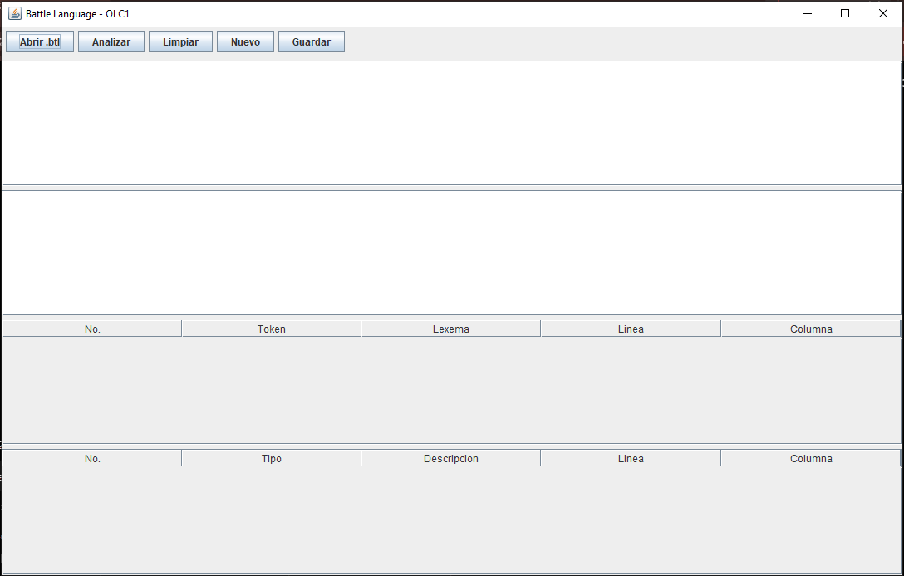
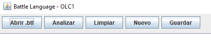
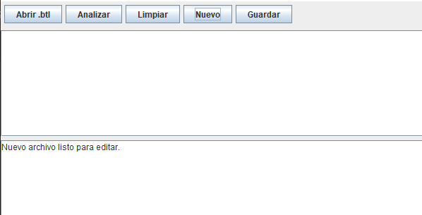
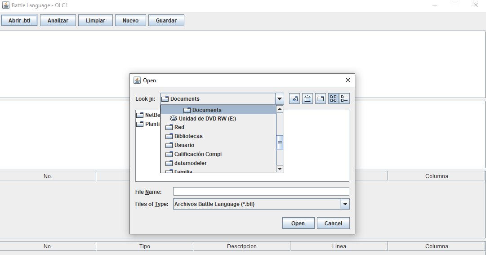
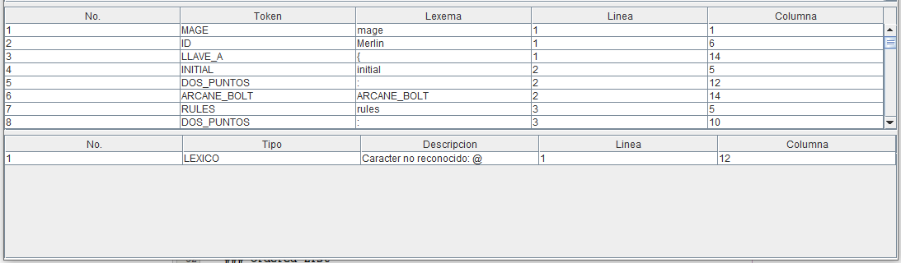

# Manual de Usuario

## Battle Language - OLC1

**Organización de Lenguajes y Compiladores 1**

---

## 1. Introducción

Battle Language es una aplicación desarrollada para analizar y ejecutar archivos .btl que solo se usan en este proyecto.

La aplicación permite crear, abrir, editar y guardar archivos con extensión `.btl`, realiza el analisis del archivo de entrada y ejecuta las partidas.

Al analizar la entrada, la aplicación muestra los tokens reconocidos, los errores encontrados y los resultados de ejecución de las batallas.

---

## 2. Entorno de trabajo

La aplicación cuenta con una interfaz gráfica que permite abrir, analizar, limpiar los campos de texto, crear nuevos archivos y asi mismo guardarlos.

La interfaz está compuesta por los siguientes elementos:

- **Abrir .btl:** permite cargar un archivo existente.
- **Analizar:** realiza el análisis y ejecución del archivo.
- **Limpiar:** limpia las áreas de trabajo de la aplicación.
- **Nuevo:** permite comenzar un nuevo archivo.
- **Guardar:** guarda el contenido actual del editor de código.
- **Editor de código:** permite escribir y modificar el contenido de los archivos `.btl`, que seria el primer cuadro que aparece debajo de los botones de las acciones.
- **Consola de resultados:** muestra el resultado del análisis y la ejecución de las partidas.
- **Tabla de tokens:** muestra los tokens reconocidos, junto con su lexema, línea y columna.
- **Tabla de errores:** muestra los errores detectados durante el análisis.

### 2.1 Interfaz principal

La siguiente imagen muestra el entorno principal de trabajo.

---

## 3. Botones para funcionalidad de la aplicacion

---

## 3.1. Crear un nuevo archivo

Para crear un nuevo archivo se debe presionar el botón **Nuevo** ubicado en la parte superior izquierda de la aplicación.

Al presionar este botón, nos mostrara un mensaje de **Nuevo archivo listo para editar** en la consola, en el cual podremos agregar las instrucciones que deseemos.

---

### 3.2 Abrir archivo

Para abrir un archivo existente se debe presionar el botón **Abrir .btl**.

La aplicación mostrará un explorador de archivos que permite seleccionar un archivo con extensión `.btl`.

Después de seleccionar el archivo, su contenido será cargado automáticamente en el editor de código de la aplicación.

---

## 3.3. Guardar un archivo

Para guardar el contenido actual del editor se debe presionar el botón **Guardar**.

Si se está trabajando con un archivo que ya fue abierto previamente, los cambios realizados reemplazarán el contenido anterior del mismo archivo.

Si se trata de un archivo nuevo, la aplicación mostrará un explorador que permitirá seleccionar la ubicación y el nombre con el cual se almacenará el archivo `.btl`.

---

## 3.4. Analizar y ejecutar un archivo

Una vez escrito o cargado un archivo `.btl`, se debe presionar el botón **Analizar**.

La aplicación realizará el análisis léxico y sintáctico del archivo. Además, ejecutará las partidas definidas en la sección `main`.

Como resultado, la aplicación mostrará:

- Partidas ejecutadas.
- Rondas de cada batalla.
- Acciones realizadas por los jugadores.
- Estado de los jugadores.
- Resultado final de cada partida.

- Cantidad de tokens reconocidos.
- Cantidad de errores encontrados.
- Tabla de tokens.
- Tabla de errores.

---

## 3.5 Limpiar

Al presionar el botón **Limpiar**.

La aplicación volvera a estar como al inicio, con cada uno de los campos vacios.

---